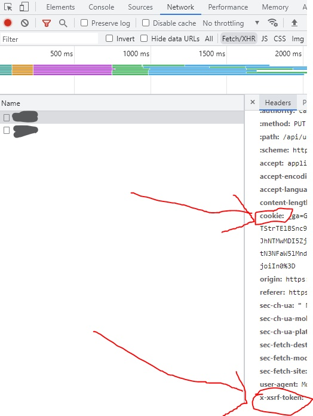
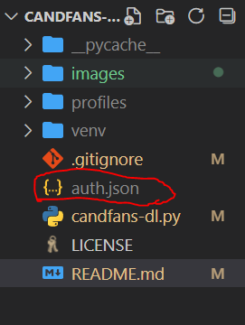
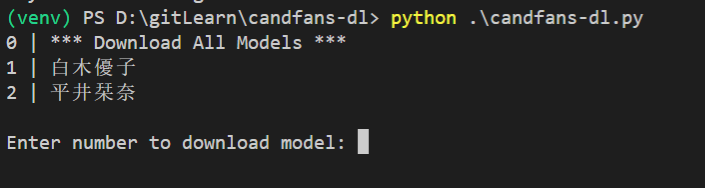

# candfans-dl

## 🎇 Introduction

Simply scrape / download all the media from an candfans account

## 🌟 Requirements

```
    pip install requests
```

## ⚡ Quick Start

1. Open browser find out the Cookie and X-Xsrf-Token.
    

2. Create auth.json file and fill in value.

    

    

3. `python .\candfans-dl.py`
    

## 🔔 License
MIT
