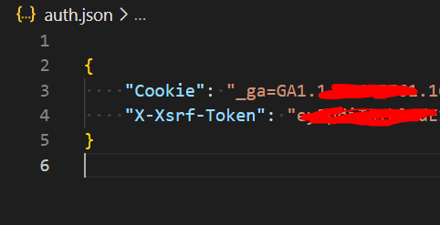

# candfans-dl

## 🎇 Introduction

Inspired by onlyfans-dl.

Only support python 3.9 | 3.10 | 3.11

## 🌟 Requirements

```
    httpx
    tqdm
    pydantic
```

## ⚡ Quick Start

1. install httpx

    `pip install -r requirements.txt`

2. Open browser find out the Cookie and X-Xsrf-Token.
    

3. Create auth.json file and fill in value.
   
   ```json
   {
        "Cookie": "",
        "X-Xsrf-Token": "",
        "User-Agent": ""
    }
   ```

    

    

4. `python .\candfans-dl.py`

    

## Feature

- type hint
- use asyncio
- good performance

## Usage

1. select all subscriptions
    - python .\candfans-dl.py
    - enter 0

2. select single subscription
    - python .\candfans-dl.py
    - enter 2

3. select part of subscriptions
    - python .\candfans-dl.py
    - enter 2,3,4

4. quit selecting
    - python .\candfans-dl.py
    - enter q

## TODO

- imporve async method
